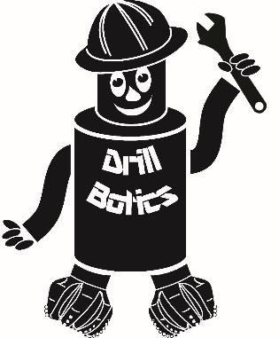
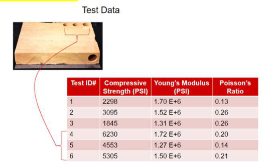
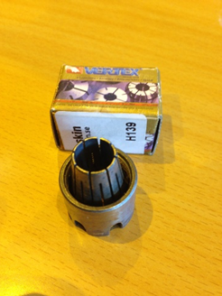

!!! info "Archive: 2024"
    This page preserves the original 2024 guidelines content as-is for historical reference. For the current rules, see the pages under "Competition" and "Tracks".

|  |  |  |
|:--:|:--:|:--:|
| [{ width="140px" }](../_assets/2024 Drillbotics Guidelines-Group B_assets/media/image1.jpg) | Society of Petroleum Engineers Drilling Systems Automation Technical Section (DSATS) International University Competition 2023–2024 Drillbotics® Guidelines Group B Revised 11 October 2023 | [{ width="180px" }](../_assets/2024 Drillbotics Guidelines-Group B_assets/media/image2.png) |

<strong>Version History</strong>

<table>
<thead>
<tr><th>Version</th><th>Date</th><th>Section</th><th>Description</th></tr>
</thead>
<tbody>
<tr><td>2024.01</td><td>11 October 2023</td><td>All</td><td>Initial release</td></tr>
</tbody>
</table>

### Introduction

> This year marks the tenth competition for the title of Drillbotics®
> champion and a chance for students to learn about the drilling process
> from industry experts and for winning team(s) to travel and present a
> paper at the next SPE/IADC Drilling Conference and at an event
> organized by DSATS. The past years involved undergraduates, masters
> and doctoral students from a variety of disciplines who built
> innovative drilling machines and downhole tools while developing a
> deeper understanding of automating the drilling process. Recently,
> this was extended to include teams who created models of the rig, the
> drilling process, and various downhole interactions. Teams freely
> shared lessons learned, which more rapidly advances the science of
> drilling automation. Everyone involved claims to have had a lot of fun
> while learning things that are not in the textbooks or published
> papers. Students also participated in related events at conferences,
> workshop meetings and networking with industry leaders in drilling
> automation. This year’s contest promises to be just as challenging and
> hopefully as much fun. For more information, see
> <https://drillbotics.com/>
>
> This year’s Group A competition again allows teams two options. They
> may compete like previous years, virtually drilling a directional
> well. Optionally, they may choose to focus on virtually detecting and
> controlling a well control event (e.g., kick). Group B will drill a
> 2-dimensional directional well under similar guidelines to last year,
> but may opt to drill a 3-dimensional well.
>
> New for 2024
>
> Continue with two groups
>
> A – Virtual
>
> B – Physical
>
> Separate guidelines for each group to reduce confusion
>
> Group A:
>
> - Create model (or option to use publicly available models) to simulate a virtual rig, or
>
> - Use their rig model to interface with a well control model provided by Norce using their OpenLab simulator.
>
> Group B:
>
> - Build and operate a physical rig to drill a 2D directional well or an optional 3D well.
>
> For A & B: Additional credit for teams that develop a D-WIS compatible API for data interoperability.
>
> Okay for two schools to join together for their entry.
>
> New Group A teams are highly encouraged to use the OpenLab Drilling
> Simulator (<https://openlab.app/>) and
> focus on designing the controls system. The D-WIS interface and
> connectivity will be used to send set-points to the simulator and
> receive surface and downhole sensor data. Webinar training on how to
> use the D-WIS interface and the simulator will be provided in October.
> Group B teams could use the simulator to validate and verify the
> interoperability of their API.
>
> Previously, teams reviewing the contest rules had to jump between the
> main body of the guidelines to various appendices depending on which
> group they chose. This year we have created separate guidelines for
> Groups A and B. The general information items that are common to both
> groups are identical. Rules specific to each group are listed in an
> appendix. Teams must also monitor the website
> (<https://drillbotics.com>) to check
> any Frequently Asked Questions (FAQs) since they become part of these
> guidelines.
>
> How did the competition first come about? The origins began in 2008
> when several SPE members established the Drilling Systems Automation
> Technical Section (DSATS) to help accelerate the uptake of automation
> in the drilling industry. DSATS’ goal was to link the surface machines
> with downhole machines, tools, and measurements in drilling systems
> automation (DSA), thereby improving drilling safety and efficiency.
> Later, at an SPE Forum in Paris, the idea of a student competition
> began to take shape; a DSATS sub-committee was formed to develop the
> competition format and guidelines further. Several universities were
> polled to find out the ability of academic institutions to create and
> manage multi-disciplinary teams. The Drillbotics committee began small
> in 2014-2015 to see if the format could succeed. With fine tuning, we
> continue along those lines as we start the 2024 process.

**Competition Overview:**

> Group A

- Option 1: The teams will design a control system that will virtually
  control their full-scale drilling system model to test and demonstrate
  their automated system’s capability to drill a directional well. The
  teams should incorporate virtual downhole and surface sensors in their
  automation and controls scheme. The well path will be defined by three
  targets provided by the Drillbotics Committee immediately before the
  final Phase II test. Teams can drill a 2D or an optional 3D
  trajectory.

- Option 2: Teams may use the D-WIS interface standard to connect to an
  OpenLab simulator offered by Norce to detect and control an influx
  (kick).

> Group B

- The challenge requires teams to develop a small-scale drilling rig and
  control system to autonomously drill a directional well following a
  given trajectory.

- Downhole sensors are mandatory, and their data must be included in the
  control algorithms.

- The well path will be defined by three targets provided by the
  Drillbotics Committee immediately before the final Phase II test.
  Teams can drill a 2D or an optional 3D trajectory.

> Phase I

- Both groups must submit a Phase I Design Report not later than 31
  December.

- A Phase I Design Video is optional, due not later than 15 January.

- Judges will review the reports and select finalists to be announced in
  early February.

> Phase II

- Teams will submit a pre-recorded team presentation approximately one
  week before the Phase II test. Judges will review the presentation and
  prepare a list of questions that will be asked of each team prior to
  the physical test.

> Tests

- Group A and B Phase II tests will be held on separate dates, to be
  advised in April. If possible, we will hold face-to-face tests in
  Germany and the USA, with an option for a virtual meeting on the same
  dates.

> The DSATS technical section believes that this challenge benefits
> students in several ways.  Petroleum, mechanical, electrical, and
> control engineers gain hands-on experience in each person’s area of
> expertise that forms a solid foundation for post-graduate careers.
> Those involved with system modeling gain insight into how models can
> gain sufficient fidelity to be applied to industry specific problems.
> They also learn where poor models or poor data can lead to incorrect
> outcomes. Students also develop experience working in
> multi-disciplinary teams, which is essential in today’s
> technology-driven industries.  Winning teams must possess a variety of
> skills.  The mechanical and electrical engineers need to build a
> stable, reliable, and functional drilling rig.  Control engineers need
> to architect a system for real-time control, including a selection of
> sensors, data handling, and fast-acting control algorithms.  The
> petroleum engineers need an understanding of drilling dysfunctions and
> mitigation techniques.  Modeling engineers must understand all of
> these basics and how to organize numerous modules into a complex
> model. Everyone must work collectively to establish functional system
> requirements, often fully understood by each team member to accurately
> portray the drilling issues and create an integrated package working
> seamlessly together.
>
> The oil and gas industry today seeks lower costs and reduced risk
> through efficiency and innovation.  Many student competitors may
> discover innovative tools and control processes that will assist
> drillers in speeding the time to drill and complete a well.  This
> includes more than a faster ROP, such as problem avoidance for
> dysfunctions like excessive vibrations, stuck pipe, and wellbore
> stability issues.  Student teams built new downhole tools using 3D
> printing techniques of designs that would be difficult, if not
> impossible to machine.  They used creative hoisting and lowering
> systems.  Teams modeled drilling performance in particular formations
> and adjusted the drilling parameters accordingly for changing downhole
> conditions.  While they have a lot to learn about our business, we
> have a lot to learn about their fresh approach to today’s problems.
> Good Luck!

**The Drillbotics® Committee**

### Contents

- [Introduction](#introduction)
- [Objectives for the 2022 Competition](#objectives-for-the-2022-competition)
- [Background](#background)
- [General Competition Guidelines](#general-competition-guidelines)
- [Team Members](#team-members)
- [Safety](#safety)
- [Expenditures](#expenditures)
- [Other Considerations](#other-considerations)
- [Project Timeline](#project-timeline)
- [Project Reports](#project-reports)
- [Group A and Group B Prizes](#group-a-and-group-b-prizes)
- [Terms and Conditions](#terms-and-conditions)
- [Marketing](#marketing)
- [Appendix A: Group B Project Definition](#appendix-a-group-b-project-definition)
- [Appendix B: Automation & Interface Design](#appendix-b-automation-interface-design-from-a-human-factors-perspective)
- [Appendix C: Additional References](#appendix-c-additional-references)

### Objectives for the 2022 Competition

1. During the school year, beginning in the fall of 2023, a team of
    students will organize themselves to solve a drilling-related
    problem outlined in Appendix A below. The team should preferably be
    a multi-disciplinary team that will bring unique skills to the group
    to allow them to design and construct hardware, software and models
    to demonstrate that they understand the underlying physics, the
    drilling issues and the usual means to mitigate the issues. We
    cannot stress enough the need to involve students with different
    technical training and backgrounds. They will need to develop skills
    to understand drilling dysfunctions and mitigation strategies, but
    they must also have the mechanical engineering and controls
    capabilities to model, design the rig/drilling package and develop
    the controls system. Even when the project involves only software,
    an understanding of the physical limits of a rig’s machinery and
    tubulars is critical. In past years, some entrants have not
    adequately considered the control network and algorithms needed for
    autonomous drilling. They have often misunderstood the need for
    calibrated sensors and fast, accurate data handling. Some teams did
    not consider measurement errors. Teams from both Group A and B
    ignored uncertainty principles. All of this and more is needed to
    build and operate a complete automated drilling system. We encourage
    all teams to start out with a simple concept done well, and then
    build on it from year to year adding complexity when warranted.
    Planning for this evolution will make it easier on future team
    members.

2. The students should produce novel ideas leading to new drilling
    models, improved drilling machines and sensors, and the ability to
    integrate the data, models and machines that will hopefully create
    new, more efficient ways to drill wells in the future. Any such
    innovation will belong to the students and their university in
    accordance with the university’s written policies. DSATS and SPE
    waive any claims to students’ intellectual property.

3. The students, working as a multi-disciplinary team, will gain
    hands-on experience that will be directly applicable to a career in
    the upstream drilling industry.

### Background

1. What is DSATS?

DSATS is a technical section of the Society of Petroleum Engineers (SPE)
organized to promote the adoption of automation techniques using surface
and downhole machines and instrumentation to improve the safety and
efficiency of the drilling process. More information is available about
DSATS at the [DSATS homepage](https://www.spe-dsats.org/).

2. Why an international competition?

DSATS and the other technical sections, as part of the SPE, are a group
of volunteers from many nations, connected by their belief that drilling
automation will have a long-term, positive influence on the drilling
industry. This diversity helped to shape the direction of the
organization. The group feels that the industry needs to attract young
professionals from all cultures and disciplines to advance drilling
practices in all areas of the world. The winners of the competition will
receive a grant for economy class transportation and accommodations to
attend the next SPE/IADC Drilling Conference and will present an SPE
paper that will be added to the SPE archives of One Petro[^1]. Note that
this year, the Drillbotics Committee will submit both Group A and Group
B winning abstracts to the conference program committee. They will
choose which of the two abstracts best fit their program. The
Drillbotics committee will help the winning team from the other Group
receive recognition of their achievement and have the opportunity via a
different conference[^2] to publish an SPE paper that will be added to
the SPE archives of One Petro. DSATS believes recognition at one of the
industry’s leading technical conferences will demonstrate to industry
leaders the extent of research and understanding the student teams have
gained during the contest. Also, the practical experience with drilling
automation systems increases the students’ visibility to the companies
that are leading automation activities.

3. Why include a safety case

Safety of personnel, equipment and the environment are always critical
for any drilling operation. The industry begins any project or operation
with safety in mind, and a safety case is a proven method of identifying
and mitigating risks. This is no different on a small scale or for a
virual operation. Safety goes far beyond personal protective equipment.
Where can someone be hurt – in a lab with heavy rock samples and
rotating machinery? Electrocution? High pressure leaks? Traveling to and
from locations? Judges want to see how teams plan ahead in their first
few meetings to identify threats and develop processes or devices to
reduce the risk and severity of any incidents.

4. Why include Human Factors?

Any complex engineered system that is wholly reliant upon human
operators to achieve its goal is likely to experience issues. Humans are
inconsistent when performing monitoring tasks, they tend to not make
wholly rational decisions, are impacted by external factors and are
prone to error. As technology advances and complexity increases (such as
the control regimes proposed in remote drilling operations for example)
such issues become more prevalent. However, many of the issues
associated with such complexity can be countered by reallocating certain
tasks to automation. Maintaining appropriate levels of automation and
ensuring that your ‘projected’ drilling operator remains ‘in the loop’
through good interface design will be one of the key challenges you will
face in the Drillbotics competition. It is imperative that teams show
how they implemented human factors in their processes and interfaces,
both in the creation of their rig or model and how the operators/judges
will use their designs.

Students working with automated systems should learn about the risks and
proper strategies to allow humans and machines to work together safely
and efficiently. Reference documents are listed in Appendix B.
Requirements for human factors provisions are shown in Appendix A.

5. Items posted on the website are part of these Guidelines

The Drillbotics website at
(<https://drillbotics.com>) includes
official updates to the competition guidelines and schedule, as well as
FAQs, photos, and previous entrants’ submittals and reports and numerous
reference documents. **Any updates to the guidelines posted on the
Drillbotics website via FAQs or blog entries from the Committee are
considered to be an official revision to these Guidelines.**

6. Questions should be directed to the competition email at
    [competition@drillbotics.com](mailto:competition@drillbotics.com).
    Teams must provide the reference number of the section of the
    guideless when you ask questions. Questions and answers will be
    incorporated into the FAQs periodically.

### General Competition Guidelines

1. Entrants to Group A challenge have the option to sign up to do a
    well control challenge. They will need to use OpenLab Drilling
    simulator (<https://openlab.app/>) with the D-WIS interface.

2. Teams also have the option to work on a 2D or optional 3D steering
    challenge. They will develop a drilling system model that represents
    a full-scale system and corresponding control scheme to virtually
    drill a directional well to a given trajectory as efficiently as
    possible within constraints of safety and economics.

3. The Group A challenge does not involve building a rig or drilling
    system. The teams will design automation and control modules to
    develop a virtual drilling system (i.e., computer models) to test
    and demonstrate the controls. Teams that develop modules that can
    updated in future years find that their code is stronger than a
    complete re-write.

4. The Group B challenge requires the design, construction, and
    operation of a physical mini-rig to physically drill a directional
    well to a given trajectory as efficiently as possible within
    constraints of safety and economics. Teams may work on a 2D or
    optional 3D steering challenge. The guidelines for Group B are
    published separately.

5. The contest covers only the drilling of one hole section. There is
    no need to run casing. There is no need for automated pipe handling
    at the surface. There is no logging or cementing. This is just a
    drilling problem. However, teams should consider sampling and
    surveying and dealing with uncertainty.

6. Judges want to see evidence that teams know about drilling and
    modeling aspects of well construction. Because teams will either
    build or model a physical rig and downhole conditions, they must
    specify the assumptions made about their project. Allowing
    judges to understand “why” you made certain choices affecting the
    evaluation of your project.

7. While the teams will have to meet minimum competition requirements,
    any exceptional contributions “above and beyond” the main theme will
    be rewarded with additional points to encourage creativity and
    innovation.

8. Teams are free to choose the hardware and software most suited to
    their design except where explicitly specified. Teams are free to
    choose any software language. Judges would like to see an
    explanation of the reason certain hardware or software was selected.

9. Teams are encouraged to review the design reports, presentations,
    and test recordings available on the website, since these include
    designs that worked or didn’t work and students thoughts about their
    earlier choices.

### Team Members

1. DSATS envisions that the students would be at least at the senior
    undergraduate or Masters level, well versed in the disciplines
    needed for such a project. The core team shall consist of at
    least three (3) team members and no more than five (5).
    Contributions from other team members is allowed, and all
    contributors should be recognized in the Phase I Design Report. The
    travel grant for the winning team will be limited to five (5) team
    members and one (1) supervisor due to budget constraints.

2. Any team that loses team members during the project can recruit a
    replacement. Note any changes to the team membership or the faculty
    advisor in the monthly reports. Include the email address of the new
    member(s). At least one member of the core team must be a Petroleum
    Engineering candidate with sufficient coursework completed to
    understand the physics relating to the drilling problems and the
    normal industry practices used to mitigate the problem. For
    universities that do not have a petroleum engineering program, two
    schools may join efforts to compete as a single entity (see 5.6)

3. Students with a background in mining, applied mathematics,
    mechanical and electrical engineering, as well as controls,
    mechatronics and automation or software development, are the most
    likely candidates, but students with any applicable background is
    encouraged.

4. A multi-disciplinary team simulates the working environment in the
    drilling industry today, as most products and services are produced
    with the cooperation of technical personnel from differing
    backgrounds and cultures.

5. A university may enter more than one team in a group and may enter
    teams in one or both groups.

6. A collaboration between not more than two universities is allowed,
    especially where one school may not offer a curriculum in a specific
    technical area needed to successfully conduct the project. The
    resulting team may only submit one Phase I design report. Also, the
    travel grant will still be limited to five (5) students and one (1)
    supervisor. Note: Any differences with intellectual property
    ownership between the two schools must be settled by the teams and
    shall not involve DSATS.

7. Students shall register their team not later than 15 October using
    the registration form on the Drillbotics website
    <https://drillbotics.com/guidelines/>. Please indicate the challenge
    (Well Control or 2D or 3D Steering) that the team will be
    participating in.

### Safety

1. The team’s safety plan should consider all foreseeable hazards and
    methods to mitigate them. Personal protective equipment is part of a
    safety plan but is far from sufficient. Teams must consider risks
    due to handling the rock, rotating machinery, electrical shock and
    others. What health considerations are in place? How the team
    communicates with each other before and during operations is also
    important. Judges will grade each team on its comprehensive safety
    plan. This applies to both Group A and Group B.

2. Because most of the Group B rigs have equipment spinning at high
    RPMs, some form of protective cover must be included in the
    team’s rig design. A broken coupling, a loose screw or similar item
    becomes a projectile that can lead to serious injury to the team
    members, judges or visitors. Judges may decide to deny a team from
    competing if their design is unsafe. Similarly, Group A teams may be
    excluded if they have not met proper health and safety
    considerations.

3. The following links are a good starting point, but is by no means a
    comprehensive list of links:

    1. OSHA Pocket Guide, Worker Safety Series:
        <https://www.osha.gov/Publications/OSHA3252/3252.html>

    2. OSHA Checklist for General Industry:
        <http://www.scosha.llronline.com/pdfs/genind.pdf>

### Expenditures

1. Teams selected to advance to the second phase must limit the cost of
    the physical or virtual rig and materials to US\$ 10,000 per year or
    its equivalent in other currencies. Students may use previous work
    and make changes within the US\$10,000 annual limit. The cost of
    transporting the rig to any local test sites is excluded. Student
    and supervisor travel is excluded. The students shall find a source
    of funding and report the source in the Phase I proposal. All
    funding and procurement should comply with university policy. These
    funds are intended to cover the majority of expenses for hardware,
    software and labor to construct and operate the team’s equipment.
    Teams will not be reimbursed for travel to any local competitions.
    DSATS shall not be liable for any expenditure other than DSATS
    provided material and specified travel expenses.

2. DSATS will assist, when possible, to obtain free PLCs or similar
    control devices and software tools from suppliers affiliated with
    the DSATS organization. Such “in-kind” donations shall not be
    included in the team’s project costs.

3. Students and universities may use other “in-kind” contributions
    which will not be included in the team’s project costs. Such
    contributions may include modeling software, laboratory equipment
    and supplies, and similar paraphernalia usually associated with
    university laboratory projects.

4. Any team spending more than US\$ 10,000, or its equivalent in other
    currencies, may be penalized for running over budget.

5. DSATS reserves the right to audit the team’s and university’s
    expenditures on this project.

6. Any devices built for the project will become the property of the
    university and can be used in future research and competitions. Any
    maintenance or operating costs incurred after the competition will
    not be paid by DSATS.

### Other Considerations

1. University coursework and credit: Each university will decide
    whether or not this project qualifies as a credit(s) towards any
    degree program.

2. The design concepts shall be developed by the student team under the
    supervision of the faculty. Faculty and lab assistants should review
    the designs to ensure student safety.

3. Construction of any equipment shall be supervised by the student
    team but may use skilled labor such as welders and lab technicians.
    The use of outside assistance shall be discussed in the reports and
    the final paper. DSATS encourages the students to gain hands-on
    experience with the construction of the rig since this experience
    will be helpful to the career of individuals in the drilling
    industry.

4. Teams building a virtual rig may create new models or improve models
    from other teams at the same university or elsewhere. Be aware of
    open source models from groups such as the Open Source Drilling
    Community (<https://opensourcedrilling.org/>). Teams must cite the
    original work done by others. Teams are also encouraged to share
    their models with the OSDC.

### Project Timeline

> Phase I - Design: Fall 2023

Submit monthly reports On or before the final day of each month starting
in October

Submit final design to DSATS 31 Dec 2023, midnight UTC

Submit an abstract to DSATS\* 31 Dec 2023, midnight UTC

Finalists to advance to Phase II Announced in mid-February 2024

\*DSATS will submit an abstract to the SPE that will include excerpts
from the student abstracts by the conference paper-submittal deadline,
typically in mid-summer, for consideration of a paper by the conference
program committee.

> Phase II

Group A: Model enhancement/testing and controls development Spring 2024

Group B: Model & controls development/Construction Spring 2024

Group A and B Phase II Test May/June 2024

### Project Reports

#### Report File Names

To avoid extra work by the committee to rename all files, teams
must use this convention for all reports:

Monthly Reports

> Year-Month# University Name (abbreviated). Note: this is the competition year (spring term).
>
> Example: for the October 2023 entry from the University of Drillbotics
> Competition (UDC)
>
> Use: 2024-10 UDC

Design reports

> Year University Name (abbreviated) Note: this is the competition
> spring term.
>
> Example: for the 2023- 2024 entry from the University of Drillbotics
> Competition (UDC)
>
> Use: 2024 UDC Phase I Design Report

#### Monthly Report Contents

Starting in October for the fall term, the student team shall submit to
DSATS a short monthly project report that is no more than one page in
length (additional pages will be ignored) due on or before the last day
of each month. Send all reports via email to
 [competition@drillbotics.com](mailto:competition@drillbotics.com). The monthly report should
include:

Phase I Monthly Report Contents

- Key project activities over the past month.

- Literature survey, rig modeling considerations, trade-offs, critical
  decision points etc.

- New or replacement team members or faculty supervisors (include their
  email address)

- Cost updates

- Significant new learning, if any

Phase II Monthly Report Contents

- Key project activities over the past month.

- Model enhancements, controls development updates.

- Preliminary results of exercising the drilling model and controls

- Cost updates

- Significant new learning, if any

#### Other items of interest

To teach students that their work involves economic trade-offs, the
monthly report should include the economic basis of decisions for
hardware or software. It should also include at a minimum a summary
estimate of team member labor hours for each step in the project:
modeling, controls, testing etc. and a cost summary for hardware and
software related expenditures. Also include labor for non-students that
affect the cost of the project. Labor rates are not considered, as to
eliminate international currency effects. Labor is not considered in the
cost limits of section 7.1 but should be discussed in the reports.

#### Phase I Design Report

Detailed requirements for each group are listed in their respective
Appendix A.

#### Final report, presentation and paper

1. The finalists shall prepare a project report that addresses items
    specific to each Group. We suggest you use the format of most SPE
    papers. For reference, please see <http://spe.org/authors/resources/>.
    This report may be submitted up to four weeks after the final test.

2. Finalists shall prepare a pre-recorded presentation two weeks prior
    to the Phase II test. Judges will review the recording and prepare a
    list of questions for the Q&A session that precedes the final test.
    Numerous examples are available online at
    <https://drillbotics.com/archives/> and our YouTube channel
    <https://www.youtube.com/channel/UCRTpKWHRiphNo6KeSqTcNyg>

3. The reports, presentations, paper and all communications with DSATS
    shall be in the English language. The presentation must be made by
    at least one member of the student team, not the team supervisor.

### Group A and Group B Prizes

1. The program committee of the Drilling Conference awarded the
    Drillbotics subcommittee a permanent slot[^3] in one of the drilling
    sessions at the conference. As per SPE’s customary procedures, the
    paper will be archived in OnePetro. In addition, SPE has agreed to
    furnish a booth[^4] in the exhibition area during the conference
    where the team can erect their rig and describe its operation to the
    conference attendees. Alternately, Group A teams will have an
    opportunity to showcase their simulation model at the booth.

2. This is an excellent opportunity for students to network with the
    industry.

3. The winning team, as determined by the conference program committee,
    will be asked to submit a paper to present at the next SPE/IADC
    Drilling Conference.

4. The Drilling Conference program committee will choose either a Group
    A or Group B winner to present at the conference. Only at their
    discretion will the second group receive an invitation to present.
    The Drillbotics Committee may fund both teams travel if it holds
    sufficient funds, which will be determined a month before the Phase
    II test.

5. The winning team will receive a travel grant[^5] to attend the
    Drilling Conference. Note that this is for a limited number of team
    members, not to exceed five (5) plus one (1) supervisor.
    Pre-approval of expenses is required.

    1. Upon submittal to DSATS of a valid expense statement of covered
        expenses (typically a spreadsheet supported by written receipts)
        individuals will be reimbursed by the treasurer of DSATS for the
        following:

    2. Round trip economy airfare for the team and one university
        sponsor/supervisor to the gateway city of the next SPE/IADC
        Drilling Conference. Entrants should use the SPE approved
        carrier where possible to minimize cost. Airfares that exceed
        the SPE rate must be pre-approved by the committee, or the
        reimbursement will be limited to the SPE rate. Information of
        reduced fare flights is available on the conference website.
        Please note that reservations must be made before the SPE
        published deadline. The departure point will be a city near the
        university, the student’s home, or current place of work,
        subject to review by the Committee. Alternately, a mileage
        reimbursement will be made in lieu of airfare should the
        entrants decide to drive rather than fly to the conference. The
        reimbursement is based on current allowable mileage rates
        authorized by the US Internal Revenue Service.

    3. One rental car/van at the gateway city for those teams that fly
        to the conference.

    4. Lodging related to one hotel room or housing unit[^6] per team
        member will be reimbursed at a rate not to exceed the SPE rate.
        Note that the room reservations are limited, so entrants must
        book their rooms early. Room and taxes for the night before the
        DSATS symposium, the night of the symposium and for the nights
        of the conference are covered. Charges for the room on the last
        day of the conference need to be pre-approved by the Committee
        as most conference attendees depart on the last day of the
        conference unless there are unusual circumstances.

    5. A per diem will be pre-approved by the Committee each year,
        which will vary with the cost of living in the gateway city. The
        per diem is intended to cover average meals (breakfast, lunch
        and dinner) and incidentals.

    6. Conference registration will be reimbursed. Students should
        register for the conference at the student rate. Early
        registration is appreciated.

6. Individual award certificates will be presented to all participants
    upon request, with special certificates given to all finalists. Team
    members wanting a certificate should send an email to
    [competition@drillbotics.com](mailto:competition@drillbotics.com) with the spelling of their name as they
    wish it to appear on the certificate.

7. DSATS may provide additional awards, at its sole discretion.

8. The evaluation and all decisions on any matter in the competition by
    the Drillbotics judges and DSATS board are final.

### Terms and Conditions

1. In no event will SPE, including its directors, officers, employees
    and agents, as well as DSATS members and officers, and sponsors of
    the competition, be liable for any damages whatsoever, including
    without limitation, direct, indirect, special, incidental,
    consequential, lost profits, or punitive, whether based on contract,
    tort or any other legal theory, even if SPE or DSATS has been
    advised of the possibility of such damages.

2. By entering this competition,

    1. Participants and Universities agree to indemnify and hold
        harmless SPE, its directors, officers, employees and agents, as
        well as DSATS members and officers, and sponsors of the
        competition, from all liability, injuries, loss damages, costs
        or expenses (including attorneys’ fees) which are sustained,
        incurred or required arising out of participation by any parties
        involved in the competition.

    2. Participants and Universities agree and acknowledge that
        participation in the competition is an agreement to all of the
        rules, regulations, terms and conditions in this document,
        including revisions and FAQs posted to the DSATS and Drillbotics
        websites (see section 3.1).

    3. Winning teams and finalists must agree to the publication of
        their names, photographs and final paper on the DSATS web site.

3. All entries will be distributed to the Drillbotics Committee for the
    purpose of judging the competition. Personal information, such as
    email addresses will not be published, but could be divulged to
    other teams being copied on competition emails. Design features will
    not be published until all teams have been judged and a winner is
    announced. Previous years’ submittals, reports, photos and similar
    documentation will be publicly available to foster an open exchange
    of information that will hopefully lead to faster learning for all
    participants, both new and experienced.

4. DSATS and the SPE cannot provide funding to sanctioned individuals
    and organizations per current US law or the laws of nations that may
    host local contests.

5. Participants must comply with all local laws applicable to this
    contest.

### Marketing

1. Upon request, DSATS will provide a link on its website to all
    participating universities.

2. If university policy allows, various industry journals may send a
    reporter to witness the tests and interview students to publicize
    the project.

3. Drillbotics is now a registered trademark. According to
    international law, the proper reference is to use Drillbotics®
    instead of Drillbotics™. The trademark reference is only needed the
    first time Drillbotics is referenced.

4. Any team that wishes to use the trademark on signs, tee shirts,
    technical papers or for other purposes may receive a no-cost license
    upon request. Send the request by email to the committee at
    [competition@drillbotics.com](mailto:competition@drillbotics.com).
    Upon completion of the license agreement, access to the files with
    the logo will be made available. Unfortunately, trademark law
    requires us to enforce this for everyone to maintain our trademark,
    so please ask for license before you use our mark.

 

## Appendix A: Group B Project Definition

### Overview

The following attached pages describe the directional objectives as well
as the data/deliverables requirements. Scoring for the directional
competition objective will be primarily based on how accurately the
directional targets are intersected by the calculated well trajectory.

### Directional Objective Requirements

#### Objectives

1. Hit one or more targets at one or more vertical depth(s) and X/Y
    coordinates

2. For the Group B competition, the starting directional plan to hit
    the targets will not require wellbore inclinations in excess of 30°
    from vertical, 15° change in azimuth, or 10” displacement (departure
    from the vertical axis at well center) The max
    displacement/inclination/azimuth are total/accumulated from the
    start to the end of the well path.

3. Please note: Teams should be prepared to drill any given trajectory
    within the specified parameters, so the coordinates will not be
    provided in advance of the test.

#### Automation Requirements

1. Drilling mode/survey mode switching must be automated (i.e. built-in
    survey interval and drill string movement for on/off-bottom,
    slide/rotation mode switching)

2. Steering requirements (e.g. toolface direction, slide length) must
    be calculated autonomously

3. NOTE: Steering mechanism can still require human intervention for
    placement and/or retrieval (e.g. whipstock) but orientation of
    steering mechanism must be calculated by the system and shown on the
    rig floor display.

4. Directional surveying process must be entirely autonomous

5. Survey qualification must be done autonomously, however secondary
    qualification/verification/override can be made by a human

6. Dogleg severity required to hit target(s), distance/direction to
    plan must be autonomously calculated at each survey station and
    shown on the rig floor display

#### Deliverables Requirements (Magnetic surveying)

1. All teams are required to provide a definitive directional survey
    (TXT, LAS, or CSV format) meeting the following minimum
    requirements:

2. Header info to include:

3. Team/school name

4. Directional Survey Date

5. Well Center Coordinates (WGS84 Latitude & Longitude)

6. True Vertical Depth Reference (in depth units above block level)

7. Grid Convergence

8. Geomagnetic model used (if applicable)

9. Magnetic declination applied (Geomagnetic model or in-field
    referenced)

10. Total Azimuth Correction

11. Magnetic field dip reference (Geomagnetic model or in-field
    referenced)

12. Total magnetic field strength reference (Geomagnetic model or
    in-field referenced)

13. Error model associated with well trajectory (ISCWSA/OWSG error model
    or otherwise)

<!-- -->

1. If non-standard error model is being used (i.e. formulas being
    modified and/or coefficients being changed), error model description
    (using standard variable/coefficient naming conventions) and
    justification must be included in project design

2. Minimum Curvature calculated trajectory (using appropriate survey
    station interval to accurately represent the drilled wellbore
    position)

3. Each survey station is to include the following data:

    1) Measured Depth

    2) Inclination

    3) Azimuth (referenced to “block north”)

    4) True Vertical Depth

    5) Northing (from well center)

    6) Easting (from well center)

    7) Dogleg Severity

4. Final survey station is to be an extrapolation to total depth at the
    bit.

5. All teams are required to provide plan vs. actual plots containing
    the following minimum requirements:

6. As-drilled trajectory and original planned trajectory shown on same
    TVD vs. Vertical Section plot.

- Vertical section direction to be determined by well center-to-target
  bearing.

1. As-drilled trajectory and original planned trajectory shown on same
    X/Y plot.

- Grid north reference to “block north”

- \[0,0\] at well center

7. All teams are required to provide directional survey raw data logs
    containing the following minimum requirements:

8. Each log entry is to include the following data:

    1. Time stamp (containing year, month, date, hour, minute, second)

    2. Sensor measured depth.

    3. Downhole sensor value(s) recorded.

        1. Sensor axes values

        2. Calculated survey qualifier values

    4. Accepted survey indicator (if log entry is an intended survey
        station)

    5. If secondary (i.e. human) qualification is also used, both
        acceptance indicators must be shown

### Safety

1) The team’s safety plan should consider all foreseeable hazards and
    methods to mitigate them.  Personal protective equipment is part of
    a safety plan but is far from sufficient.  Teams must consider risks
    due to handling the rock, rotating machinery, electrical shock and
    others.  How the team communicates with each other before and during
    rig operations is also important.  Judges will grade each team on
    its comprehensive safety case.

2) Because most of the rigs have equipment spinning at high RPMs, some
    form of protective cover must be included in the team’s rig design.
    A broken coupling, a loose screw or similar item becomes a
    projectile that can lead to serious injury to the team members,
    judges or visitors.  Judges may decide to deny a team from competing
    if their design is unsafe.

3) The following links are a good starting point, but is by no means a
    comprehensive list of links:

> OSHA Pocket Guide, Worker Safety Series:
> <https://www.osha.gov/Publications/OSHA3252/3252.html>
>
> OSHA Checklist for General Industry:
> <http://www.scosha.llronline.com/pdfs/genind.pdf>

### Phase I – Design Competition

1) Prepare a safety plan at the beginning of the project and update it
    continually as needed.

2) Consider how you will use Human Factors within you project to
    improve your team processes and interactions with your model.  You
    should include such items as:

    1. Who are the operators of your drilling rig and how do their
        characteristics impact the design?

    2. Which functions of your drilling rig will be automated, and
        which will be manual (refer to Ref. 2)?

    3. How are you going to ensure that the operator remains 'in the
        loop' at all times?

    4. The workflow that your drilling rig will follow (very important
        as this will guide your interface design).

    5. The control and feedback needs for your defined operators.

    6. The 'concept' of your interface design. This can be as simple as
        a 'wireframe' drawing with pen and paper, but it should show an
        appreciation of Human Factors Relevant Good Practice (refer to
        the resources provided below).

3) The first phase of the project starts in the fall, requiring teams
    to organize to design an automatic drilling machine to solve the
    project problem.  It is not necessary to build any equipment in this
    phase, but it is okay to do so.  Design considerations should
    include current industry practices and the team should evaluate the
    advantages and shortcomings of today’s devices.  The design effort
    may be assisted by university faculty, but the students are
    encouraged to introduce novel designs for consideration.  The design
    should also include a downhole sensor and a control system to
    automatically control the drilling process.  The level of student,
    faculty and technical staff involvement shall be reported when
    submitting the design.  For returning teams, the Phase I Design
    Report should include an analysis of data and learnings from
    previous (“offset”) wells drilled.

4) During the second phase, in the spring, the finalist selected by
    DSATS to proceed to the construction and drilling operation will use
    the previous semester’s design to build an automated drilling
    machine.  As per industry practices, it is common during
    construction and initial operations to run into problems that
    require a re-design.  

<!-- -->

1. The team may change the design as needed in order to solve any
    problems they encounter.

2. Changes should be reported to the Committee via students’ monthly
    reports.  A summary of all significant changes, including the reason
    modifications were necessary, must be included in the students’
    final report.

3. Teams may use all or part of a previous year’s rig.

### Phase I Design Report

The design submittal by the students shall include:

1) Student Biographies

- Name

- Previous degree attained – major.

- Current degree and expected graduation date (month/year)

- Main area of contribution to the project

- Other information as deemed appropriate by the team.

2) A description of your safety plan that is appropriate for the
    project.

3) Engineering sketches or drawings of the rig concept, mechanical and
    electrical and auxiliary systems, if any, that explain your design
    assumptions

4) Include any design notes and calculations regarding rig, drillstring
    and other limitations for the particular modules used in your
    models.  

5) A block diagram/flowchart of the modeled control system
    architecture.  Describe the key features.  The response time of
    measurements, data aggregation and control algorithms should be
    estimated. Explain how individual measurements are used are in the
    control code.  Are they all given equal weight, and if not, what
    criteria is used to assign importance?

6) Since this is a directional drilling problem, be sure to include how
    downhole data is used for steering and other drilling aspects?
    Judges are looking for a description of the principles being applied
    to directionally steer the wellbore and hit the required targets
    with the intent to score the maximum number of points.

7) Proposed user interface/data display that shows the drilling
    progress in real time.

8) Cost estimate and funding plan

9) Key features for any models/modules and control software.  What
    drilling dysfunctions are addressed?

10) Proposed data handling, i.e., inherent time delays and uncertainty.

11) The Phase I design report should include a discussion regarding the
    major design concept as modeled (mechanical and otherwise) with
    respect to the feasibility for use on today’s working rigs?  If not,
    what would be needed to allow implementation?

Additional optional items:

12) A design summary video used to outline the design submittal not to
    exceed five (5) minutes in length.  Videos shall be the property of
    the university, but DSATS shall have the rights to use the videos on
    its websites and in its meetings or events.

13) Phase I Evaluation

<!-- -->

1. The judges will review the design reports and rank teams using the
    same criteria as the Phase II evaluation information below.

2. The results will be announced in mid-February with comments that
    teams may want to incorporate into their Phase II efforts.

3. The committee will advance as many teams as is economically possible
    as finalists for Phase II.

### Design Criteria

#### Overview

> Teams will design, create and operate a small-scale rig drill a
> directional well safely and efficiently.  The Drillbotics committee
> will provide certain information in advance but will not provide the
> actual well targets until the day of the Phase II test.  The following
> attached pages describe the directional objectives as well as the
> data/deliverables requirements. Scoring for the directional
> competition objective will be primarily based on how accurately the
> directional targets are intersected by the calculated well
> trajectory.  An example of the criteria for scoring is included below.
>
> The end goal is for teams to develop a mini-rig with automated
> controls to drill autonomously prepare a planned well path once the
> target points are established.  The well directional well should be
> drilled as close to the targets as is practical, keeping in mind build
> rates, wellbore tortuosity, and overcoming drilling dysfunctions while
> operating within the limits imposed by the drilling equipment and
> drillstring.

#### Objectives

1. Hit one or more targets at one or more vertical depth(s) and X/Y
    coordinates.

2. For the Group B competition, the starting directional plan to hit
    the targets will not require wellbore inclinations in excess of 30°
    from vertical, 15° change in azimuth, or 10” displacement (departure
    from the vertical axis at well center) The max
    displacement/inclination/azimuth are total/accumulated from the
    start to the end of the well path.

3. Please note: Teams should be prepared to drill any given trajectory
    within the specified parameters, so the coordinates will not be
    provided in advance of the test.

4. Teams must deal with multiple constraints like those faced by
    practicing drilling engineers designing difficult wells. Each team
    should design their own well trajectory plan after receiving
    competition targets. Their systems should autonomously determine the
    trajectory, taking into consideration the physical limitations that
    they have defined for their specific system. If a team feels that
    their system will not be able to hit the targets, the plan should be
    designed to get as close to the targets as possible. Judges will
    assess your assumptions and calculations to see how well you
    understand the issues. Be sure to explain what testing was done to
    confirm your assumptions.

#### Rig Design

1. DSATS envisions a small (perhaps 2 meters high) drilling machine
    that can physically imitate the functionality of full-scale rig
    machinery.  Since the winning machines will be presented at the SPE
    conference, there may be height restrictions imposed by the
    conference facility, so machines that are too tall may not be
    allowed on the exhibit floor.  

2. The winning team may need to ship their rig by airfreight to display
    it at an industry conference.  Please give considerable thought to
    the physical design to reduce the overall dimensions.  Designs with
    a folding and/or telescopic derrick and nested bases can reduce the
    shipping costs considerably.  For this reason, Drillbotics asks
    students to calculate the “chargeable weight” per section d.vi.1
    below, and judges use this figure when comparing team performance.

3. The machine will be the property of the university and can be used
    in future research and competitions.  New and novel approaches that
    improve on existing industry designs are preferred.  While
    innovative designs are welcome, they should have a practical
    application to drilling for oil and gas.

4. The drilling machine will use electrical power from the local grid
    not to exceed 25 horsepower.  Lower power consumption resulting from
    energy efficient designs will receive additional consideration.

5. The design must provide an accurate and continuous measurement of
    Weight-On-Bit (WOB), inclination, azimuth, and depth; as well as
    other drilling parameters (see Appendix “A” for directional
    surveying-specific data requirements), that should be presented as a
    digital record across the period of the test.  All depth related
    measurements shall use the rig floor as the datum, not the top of
    the rock (the offset between the rock surface and the rig floor must
    be adequately processed within the control algorithms). Appropriate
    statistical measurements should be made at frequencies and with an
    accuracy and appropriate frequency content for the dynamics of the
    drilling system both at surface and downhole.  Discussion of such
    choices should be included in the design report.

    1. Distinguish in all data and documentation the difference between
        Weight-On-Bit and Hook Load; be specific when referring to these
        parameters.

6. A closed-loop fluid circulation system is not required, but could be
    of advantage for directional drilling, the bit and machinery should
    be cooled with air or fluid/water if needed.  The design of the
    fluid system, if any, should be included in the Phase I design.

    1. The rock sample will be homogeneous and will be capable of
        aiding in closed-loop fluid circulation.

    2. Note that the rock samples will leak once the drillbit punctures
        a rock face, so a rig design that includes a containment system
        is required.

#### Design Calculations

1. Design submittal by the students shall include:

    1. Engineering drawings of the rig concept, mechanical and
        electrical and auxiliary systems, if any

2. Design notes and calculations

    1. All engineering calculations shall be included in the Phase I
        report, even if the rig is built using previous years’ designs.
        This ensures that the 2022 team reviewed and understood the
        previous design assumptions and calculations.

    2. Calculations should include each formula considered in the
        design, a reference that shows the origins of the formula, why
        is was chosen, what engineering assumptions were made, a
        definition of all variables and the values used in the
        calculation.  

> Example:
>
> Buckling limit        Euler’s Equatio(1) cite a reference here or in
> the reference
>
> section of your design report
>
> The critical buckling load, *b*𝑐𝑟, is calculated:  
>
> 𝑃𝑏𝑐𝑟 = 𝜋2 ∗ 𝐸 ∗𝐼 /(𝐾∗ 𝐿)2
>
> 𝑃𝑏𝑐𝑟:     Critical buckling load
>
> 𝐸:          Modulus elasticity of the aluminum drill pipe
>
> 𝐼:          Area moment of inertia
>
> 𝐿:          Length of the column
>
> 𝐾:          Column effective length factor (explain how you chose the
> appropriate k or n factor)

3. The report should include a table that summarizes ALL calculations.

Example

<table>
<colgroup>
<col style="width: 15%" />
<col style="width: 8%" />
<col style="width: 9%" />
<col style="width: 10%" />
<col style="width: 10%" />
<col style="width: 9%" />
<col style="width: 10%" />
<col style="width: 11%" />
<col style="width: 13%" />
</colgroup>
<thead>
<tr>
<th rowspan="2" style="text-align: center;">Parameter</th>
<th rowspan="2" style="text-align: center;">Symbol</th>
<th colspan="2" style="text-align: center;">Calculated Results</th>
<th rowspan="2" style="text-align: center;">Safety Factor</th>
<th colspan="2" style="text-align: center;">Max Allowable</th>
<th rowspan="2" style="text-align: center;">Reference</th>
<th rowspan="2">(Other as needed)</th>
</tr>
<tr>
<th style="text-align: center;">Field Units</th>
<th style="text-align: center;">Metric Units</th>
<th style="text-align: center;">Field Units</th>
<th style="text-align: center;">Metric Units</th>
</tr>
</thead>
<tbody>
<tr>
<td>Critical buckling load</td>
<td></td>
<td></td>
<td></td>
<td></td>
<td></td>
<td></td>
<td></td>
<td></td>
</tr>
<tr>
<td>Burst limit</td>
<td></td>
<td></td>
<td></td>
<td></td>
<td></td>
<td></td>
<td></td>
<td></td>
</tr>
<tr>
<td>Torque limit</td>
<td></td>
<td></td>
<td></td>
<td></td>
<td></td>
<td></td>
<td></td>
<td></td>
</tr>
<tr>
<td>… Other</td>
<td></td>
<td></td>
<td></td>
<td></td>
<td></td>
<td></td>
<td></td>
<td></td>
</tr>
</tbody>
</table>

4. Because the winning team’s rig could be shipped to a different
    country for display in the SPE booth at the Drilling Conference, the
    Drillbotics team needs to prepare in advance to provide adequate
    electrical power for the rig.  Please provide a table showing the
    expected power consumption.  Rename devices as appropriate:

<table>
<colgroup>
<col style="width: 12%" />
<col style="width: 11%" />
<col style="width: 11%" />
<col style="width: 6%" />
<col style="width: 9%" />
<col style="width: 23%" />
<col style="width: 24%" />
</colgroup>
<thead>
<tr>
<th rowspan="2" style="text-align: center;">Device</th>
<th rowspan="2" style="text-align: center;">Voltage</th>
<th rowspan="2" style="text-align: center;">Current</th>
<th colspan="2" style="text-align: center;">Estimated</th>
<th rowspan="2">Single or Three ɸ</th>
<th rowspan="2">(Other as needed)</th>
</tr>
<tr>
<th style="text-align: center;">HP</th>
<th style="text-align: center;">Watts</th>
</tr>
</thead>
<tbody>
<tr>
<td>Rotation</td>
<td></td>
<td></td>
<td></td>
<td></td>
<td></td>
<td></td>
</tr>
<tr>
<td>Hoist</td>
<td></td>
<td></td>
<td></td>
<td></td>
<td></td>
<td></td>
</tr>
<tr>
<td>Pump</td>
<td></td>
<td></td>
<td></td>
<td></td>
<td></td>
<td></td>
</tr>
<tr>
<td>… Other</td>
<td></td>
<td></td>
<td></td>
<td></td>
<td></td>
<td></td>
</tr>
<tr>
<td>Controls</td>
<td></td>
<td></td>
<td></td>
<td></td>
<td></td>
<td></td>
</tr>
<tr>
<td>Displays</td>
<td></td>
<td></td>
<td></td>
<td></td>
<td></td>
<td></td>
</tr>
<tr>
<td>…</td>
<td></td>
<td></td>
<td></td>
<td></td>
<td></td>
<td></td>
</tr>
<tr>
<td style="text-align: center;">Total</td>
<td></td>
<td></td>
<td></td>
<td></td>
<td></td>
<td></td>
</tr>
</tbody>
</table>

5. Also provide a diagram showing maximum dimensions of rig when
    operational (Include all auxiliaries) \[Needed to determine size of
    display area as the Drilling Conference and confirm the height is
    within the limits imposed by the conference organizers\]

6. Please calculate and include in your report the “Chargeable Weight”
    of the rig, including shipping crates/boxes for the rig and
    auxiliaries

    1) The Chargeable Weight of Freight shipments are calculated as the
        Actual Weight (Gross Weight) or the Volumetric (also called
        Volume or Dimensional) Weight of the shipment, whichever is the
        greater. This uses an estimated weight that is calculated based
        on the dimensions (length, width and height) of a package
        (shipments are always shown in the order of L x W x H).
        Typically, large items with a light overall weight take up more
        space on an aircraft than a small, heavy item. That’s why the
        shippers charge according to Chargeable Weight.

    2) Multiply the length by the width by the height (L x W x H) in
        inches to obtain the cubic inches, then:

    3) To obtain the dimensional weight in pounds using inches, divide
        the cubic inch result by 166

    4) To obtain the dimensional weight in kilograms using inches,
        divide the cubic inch result by 366

    5) Using Dimensions in Centimeters: To obtain the dimensional
        weight in kilograms using centimeters, multiply the length by
        the width by the height (L x W x H) in centimeters and divide
        the result by 6000

7. Control system architecture.  (The response time of measurements,
    data aggregation and control algorithms should be estimated.)

8. Key features for any models and control software.

9. Proposed data handling and display.

10. Specification for sensors, signal processing and instrumentation,
    (verifying their accuracy, precision, frequency response and
    environmental stability), including the methods planned for
    calibration before and after the Phase II testing.

11. Plan for instrumentation of sensors in the BHA, as well as a method
    to synchronize all measurements and utilize both the surface and
    downhole sensors for real-time control of the drilling process.  

12. An explanation of the implementation of the output of the BHA
    sensors to improve the trajectory of the wellbore, drilling
    efficiency and other drilling concerns.

13. An explanation of the algorithm used to autonomously control the
    drilling rig based on the output of the BHA sensors.

14. An explanation of the principles being applied to directionally
    steer the wellbore and hit the required targets with the intent to
    score the maximum amount of points.

15. Cost estimate and funding plan

16. A design summary video used to outline the design submittal not to
    exceed five (5) minutes in length.  Videos shall be the property of
    the university, but DSATS shall have the rights to use the videos on
    its websites and in its meetings or events.

17. All design, construction and operation of the project are subject to
    the terms and conditions of section 13 above.

18. The Committee) will review the Phase I designs and select the
    top-ranking teams who will progress to Phase II of the competition.

#### Automation Requirements

> Drilling mode/survey mode switching must be automated (i.e. built-in
> survey interval and drill string movement for on/off-bottom,
> slide/rotation mode switching)

#### Steering

1) Directional steering is a critical part of the competition for
    2023.  The wellbore must be started vertically and then kicked off
    below a specified depth to hit multiple directional targets (at
    varying X/Y coordinates and vertical depths). Teams score more
    points based on how accurately each directional target is hit.

2) The targets for the final test will be provided only on the day of
    the test.

3) Steering requirements (e.g., toolface direction, slide length) must
    be calculated autonomously.

4) Orientation of the steering mechanism must be calculated by the
    system with results shown on the rig floor display.

#### Downhole Sensors

> Downhole sensors are mandatory, and it is also mandatory to implement
> their data into the control algorithm of the rig.  A severe penalty
> will be applied to teams who do not use downhole sensors.  Closed loop
> control of the rig based on downhole data is mandatory in this year’s
> competition and not integrating this data set into the control
> algorithm is considered a “F- Failing grade” in this year’s
> competition.

#### Surveys

1. Directional surveying process must be entirely autonomous.

2. Survey qualification must be done autonomously, however secondary
    qualification/verification/override can be made by a human.

3. Dogleg severity required to hit target(s), distance/direction to
    plan must be autonomously calculated at each survey station and
    shown on the rig floor display.

#### Deliverables Requirements (Magnetic surveying)

1. All teams are required to provide a definitive directional survey
    (TXT, LAS, or CSV format) meeting the following minimum
    requirements:

2. Header info to include:

<!-- -->

1. Team/school name

2. Directional Survey Date

3. Well Center Coordinates (WGS84 Latitude & Longitude)

4. True Vertical Depth Reference (in depth units above block level)

5. Grid Convergence

6. Geomagnetic model used (if applicable)

7. Magnetic declination applied (Geomagnetic model or in-field
    referenced)

8. Total Azimuth Correction

9. Magnetic field dip reference (Geomagnetic model or in-field
    referenced)

10. Total magnetic field strength reference (Geomagnetic model or
    in-field referenced)

11. Error model associated with well trajectory (ISCWSA/OWSG error model
    or otherwise)

    1. If non-standard error model is being used (i.e., formulas being
        modified and/or coefficients being changed), error model
        description (using standard variable/coefficient naming
        conventions) and justification must be included in project
        design.

<!-- -->

3. Minimum Curvature calculated trajectory (using appropriate survey
    station interval to accurately represent the drilled wellbore
    position)

<!-- -->

1. Each survey station is to include the following data:

    1. Measured Depth

    2. Inclination

    3. Azimuth (referenced to “block north”)

    4. True Vertical Depth

    5. Northing (from well center)

    6. Easting (from well center)

    7. Dogleg Severity

2. Final survey station is to be an extrapolation to total depth at the
    bit.

#### Plots

1. All teams are required to provide plan vs. actual plots containing
    the following minimum requirements:

2. As-drilled trajectory and original planned trajectory shown on same
    TVD vs.

3. Vertical Section plot

    1. Vertical section direction to be determined by well
        center-to-target bearing.

    2. As-drilled trajectory and original planned trajectory shown on
        same X/Y plot.

    3. Grid north reference to “block north”

    4. \[0,0\] at well center

#### Data Logs

1. All teams are required to provide directional survey raw data logs
    containing the following minimum requirements:

2. Each log entry is to include the following data:

    1. Time stamp (containing year, month, date, hour, minute, second)

    2. Sensor measured depth.

    3. Downhole sensor value(s) recorded.

        1. Sensor axes values

        2. Calculated survey qualifier values

    4. Accepted survey indicator (if log entry is an intended survey
        station)

        1. If secondary (i.e., human) qualification is also used, both
            acceptance indicators must be shown.

#### Formation/Rock

1. The university and/or students must acquire or produce at their own
    cost rock samples as needed to verify the design and allow students
    to practice using their machine prior to the test.  Drilling of any
    samples provided by DSATS prior to Phase II testing is not allowed
    and could lead to disqualification, except for the pilot hole to be
    drilled at the test location.

2. For the final test, the teams will need to procure the rock and get
    the rock tested.    A typical sample has the following properties:

> { style="width:5.72917in;height:3.4375in" }

3. The sample should be prepared per the following:

    1. A homogeneous sandstone samples appx. 12” W x 24” L x 24” H (30
        x 60 x 60 cm) for the final demonstration

4. Please contact Drillbotics at [competition@drillbotics.com](mailto:competition@drillbotics.com) if you
    have difficulty obtaining your sample.

#### Targets

> The targets will not be available until immediately prior to the Phase
> II test.  However, the starting directional plan to hit the targets
> will not require wellbore inclinations in excess of 30° from vertical,
> 15° change in azimuth.  Note: This is a maximum.  Be prepared for much
> smaller build rates.

#### Trajectory

> Teams shall choose their own trajectory to optimize the drilling, the
> well path and closeness to the given targets.  This should be computed
> autonomously after the targets are manually entered.  Limit the scope
> to 2-D for both the steering model as well as the formation model.
>
> for BHA/bit deflection behavior.  Optionally, you may add 3-D steering
> if you need to make course corrections along the nominally 2-D well
> path.

#### Bits

1. Upon request, DSATS will send a bit to the finalist teams for use in
    Phase II.  It is expected that the BHA and pipe will cause some
    difficulty, both for initiating drilling dysfunction and for sensor
    integration and data telemetry.  The judges will look for creative
    concepts supported by sound reasoning showing an understanding of
    how the BHA, bit and drillstring function together, and how the
    downhole system measures, samples and transmits the drilling data.

2. Upon request, the bit shall be returned to the Committee following
    Phase II testing for reconditioning for use in future competitions.

3. One (1) PDC bit will be provided by DSATS to be used during the
    Phase II tests.  For 2020-2021 the bit will be:

    1. A micro-bit 1.5" in (38.1 mm) diameter and 2.0” in total
        length.

    2. Low axial aggressiveness and high side aggressiveness (i.e. high
        bit anisotropy).

    3. Bits will not be available before mid-April at the earliest.

4. Students are encouraged to consider bit wear prior to the final test
    and its impact on drilling performance during the onsite testing.
    Based on prior competitions, bit wear should be minimal, but some
    cutter damage is always possible.  **Teams will only receive at most
    one bit.**

5. Student teams may build or buy similar drill bits to test their
    design with the rock samples they sourced. The students must not
    engage any third parties or receive professional assistance in
    designing their own bit, however manufacturing can be performed by a
    third party.

6. For the final competition, the students may use the directional
    drill bit provided by DSATS or use their own bit design. However,
    the dimensions of their bits must not exceed 1.5 inches in diameter
    and 2 inches long. This provision is made to enable students to
    fully optimize the bit design for their specific directional
    system.

#### Drillstring

1. Drillpipe

    1. Preliminary typical tubing specifications for aluminum tubing
        are listed below to assist with the mechanical and electrical
        design of the rig.  Stainless steel tubing or aluminum tubing is
        permitted for the competition but must use the same dimensions
        as below, or the nearest metric equivalent.  Teams may choose
        durability over flexibility and shall explain their choice in
        the design report.

    2. There is no restriction on drill pipe diameter or hole diameter.

    3. DSATS will not be providing tubing to the competition
        teams.

    4. The use of a metric equivalent of the tubing is permitted.

    5. Tubing is usually available from various hobby shops such as K-S
        Hobby and Craft Metal Tubing and via Amazon and other suppliers.

> <http://www.hobbylinc.com/htm/k+s/k+s9409.htm>

2. Tool joints

    1. Students may design their own tool joints as long as the design
        concept is included in the Phase I proposal.

    2. Alternately, students may use commercially available
        connectors/fittings attached to the drillpipe using threads,
        epoxy cement or other material, and/or may use retaining screws
        if desired, as long as the design concept is included in the
        Phase I proposal.  

    3. A fitting used somewhat successfully in 2017 is available from
        Swagelock.  In 2018, the winning team used a fitting from
        Vertex.

    4. { style="width:1.63542in;height:2.1875in" } A
        fitting used successfully in 2016, but which did not work well
        in 2017, is available from Lenz
        (<http://lenzinc.com/products/o-ring-seal-hydraulic-tube-fitting/hydraulic-straight-connectors>)
        that uses a split-ring to allow a torque transfer across the
        fitting.

    5. Students must state WHY they choose a tooljoint design in the
        Phase I proposal.

3. Bit sub/drill collar/stabilizers

    1. It is expected that each team will design and build their own
        bit sub.  Instrumentation of the bit sub is ideal for
        directional sensors.

    2. Additional weight may be added to the bit sub, or surface
        weight/force (above the rock sample) may be applied to provide
        weight on bit and drill pipe tension

    3. Stabilizers are permitted but will be limited in length at the
        discretion of the Challenge Committee.  Advise the committee of
        your choice and why and include this in the Phase I design for
        committee consideration.

    4.  Students must add sensors to the drillstring but are not
        permitted to instrument the rock samples. They must have a
        smaller diameter than the stabilizers and bit by at least 10%.
        Please include design concepts in the Phase I design.

    5.  The addition of along-string sensors to measure vibrations,
        verticality and/or tortuosity or other parameters will receive
        extra consideration. They must have a smaller diameter than the
        stabilizers and bit by at least 10%.

#### Automated Drilling

1. Drilling automation should be considered a combination of data,
    control AND dynamic modeling so that the control algorithm can
    determine how to respond to differences between the expected and
    actual performance.  Process state detection can often enhance
    automation performance.  Refer to documents posted on the DSATS
    website for more information.

2. Once drilling of the sample commences, the machine should operate
    autonomously.  Remote operation and/or intervention is not allowed.

3. All directional control operations should be autonomously controlled
    by the drilling rig.

    1. Manual intervention to add and/or remove a steering mechanism
        (e.g., whipstock) is permitted, however the
        determination/calculation of the orientation setting of the
        mechanism is required to be autonomous and must be shown on the
        rig floor display during each steering mechanism manipulation
        activity.

    2. Length and timing of drilling modes (e.g., switching from slide
        drilling to rotational drilling, initiating the directional
        surveying procedure at the appropriate survey interval), must be
        autonomously determined/calculated and controlled.

    3. Directional surveys acquired by the system need to be used as
        feedback for the steering control (and/or calculation of the
        steering requirements) logic.

4. Set-point commands for drilling parameters (WOB, RPM, ROP, etc.)
    should be optimized such that drilling dysfunctions are avoided, and
    drilling can be completed within the given time frame. Real-time
    optimization should be done automatically. The controllers need to
    ensure that the drilling parameters respond once the set points are
    altered.

#### Sensors

1. The team may elect to use existing oilfield sensors or may look to
    other industries for alternate sensors.

2. The team may develop its own sensors if so desired.

3. Sensor quality differs from data quality.  Both are important
    considerations in this competition.

4. The final report shall address which sensors were selected and why.
    The sensor calibration process shall also be explained.

#### Data collection and handling

1. The team may elect to use standard data collection and recording
    techniques or may develop their own.  Data handling techniques and
    why they were chosen should be described in the Phase I submittal.

2. The final report shall address which data systems were selected and
    why.

3. The observed response time of measurements, data aggregation and
    control algorithms should be compared to the Phase I estimates and
    published in the final report.  

4. Describe how data is measured, aggregated, stored and retrieved.
    Describe calibration and data validation techniques used.

#### Data visualization

1. Novel ways of presenting the data and progress of drilling in real
    time while drilling will receive particular attention from the
    judges.

2. Visualization of the processes (automation, optimization, drilling
    state, etc.) should be intuitive and easily understood by the
    judges, who will view this from the perspective of the driller
    operating a rig equipped with automated controls.

3. Data must be presented in a format that allows the judges to easily
    determine bit depth, elapsed drilling time, ROP, MSE,
    verticality/inclination, vibration, and any other calculated or
    measured variable used to outline the drilling rigs performance to
    the judges. Lack of an appealing and usable Graphic User Interface
    (GUI) will be noted to the detriment of the team.

4. All depths shall use the industry-standard datum of rotary/kelly
    bushing interface (RKB), which should be the top of the rig’s “drill
    floor.”

5. An End of Well (EOW) report should be provided to the judges at the
    conclusion of drilling.

#### Measure and analyze the performance

1. The drilling machine should react to changing “downhole” conditions
    to select the optimal drilling parameters for improved performance,
    as measured by the rate of penetration (ROP), mechanical specific
    energy (MSE), verticality, cost per foot or meter, and other
    standard drilling measures or key performance indicators.   Adding
    parameters such as MSE, or similar features, to the control
    algorithms will receive special attention from the judges.

2. Design limits of the drilling machine shall be determined and shall
    be incorporated in the programming of the controls during the
    construction phase.

3. Downhole measurements from directional sensors are to be used for
    adjusting drilling parameters and control of drilling machines used
    to aid in directional drilling.

#### Not included in the 2021-2022 competition

1. The drilling will not include automating the making or breaking of
    connections.  If connections are necessary due to the rig and
    drillstring design, connections should be made manually, and the
    time involved with the connections will be included with respect to
    its effect on drilling performance (rate of penetration reduction).

2. A rig move, walking or skidding is not required, but the mobility of
    the rig will be considered in the design phase.  

### Phase I Design Report

1. Teams will submit a detailed report containing detailed literature
    review, model assumptions, overall plan of the virtual system,
    including the system architecture, different layers (such as data
    layer, control layer etc.), mathematical framework for modeling and
    control schemes, a plan for implementation, and relevant details. It
    is preferable to include special section for the API, if other
    system need to interact with your system.  Preliminary results from
    the virtual drilling rig model should be included, along with a
    discussion on the results.

2. There are numerous examples of previous reports on the Drillbotics
    website.  Feel free to use this as a resource.  Should a team choose
    to use the concepts in previous reports in their design, be sure to
    cite the source of the information to avoid plagiarism concerns.

3. A safety case shall be part of the Phase I design (see Appendix
    “B”).  Include a review of potential hazards during the planned
    construction and operation of the rig, and for the unloading and
    handling of any rock samples or other heavy items.  An example of a
    safety case will be posted on the Drillbotics.com website.

4. The Phase I design report should include a discussion regarding the
    major design features proposed (mechanical and otherwise) - are they
    scalable to today’s working rigs?  If not, what would be needed to
    allow implementation?

5. The Phase I design report should include a discussion regarding the
    control scheme and algorithm - How is each individual measurement
    used in the control code?  Are they all given equal weight, and if
    not, what criteria is used to assign importance? What is the
    expected response time of the control system’s key components?  How
    will this affect equipment selection?  The teams are encouraged to
    perform control simulations to verify the control scheme.

### Phase II – Drilling Competition

1. Phase II Activities

<!-- -->

1. Monthly progress reports are due at the end of each month.

2. Teams will deliver a pre-recorded presentation for the Phase II test
    two weeks prior to the test:

3. The students will present a BRIEF summary of their final design,
    highlighting changes from their Phase I design, if any. Include an
    explanation of why any changes were necessary, as this indicates to
    the judges how much students learned during the design and
    construction process.  Explain what *key* features have been
    deployed.  Describe novel developments or things learned that were
    worthwhile.  Also include how actual expenses compared with the
    initial estimate.    At some time during your talk, let us know who
    the team members are and what background they have that pertains to
    the project.  Try to include all your team members as presenters,
    not just one spokesperson.  The committee wants to see if all team
    members have a good understanding of key issues.  

4. Previous teams used a short PowerPoint presentation of about ten
    slides or so.  Use any format you like.

<!-- -->

2. Phase II Testing

<!-- -->

1. In the spring term of 2023, qualifying teams will build the rig and
    use it to drill rock.  Drilling a deviated well to hit the required
    targets (see Appendix “A”), efficiently through the sample while
    controlling drilling dysfunctions is the primary technical objective
    of the competition.  Scoring of the directional drilling component
    will be primarily based on the horizontal distance from the target
    coordinate at which each target vertical depth was intersected. The
    use of both surface and downhole measurements to control the
    drilling process in real-time is mandatory, failure to do so will
    result in a failing grade.  To avoid disqualification due to a
    downhole sensor failure, redundant or immediately replaceable items
    should be part of the design and implementation.  Time to replace a
    sensor will be added to the drilling time for calculation of ROP.

2. Prior to the start of the test:

    1. Teams are to use manual control to pre-drill a vertical pilot
        hole not more than 1” deep measured from the rock’s top face.
        This hole is to be drilled using the competition drilling rig.
        Location of this pilot hole will be marked on each sample by the
        committee at the intersection of two lines drawn from opposite
        corners of the rock sample.  Drillbotics could modify the
        starting point a few weeks before the contest, so design your
        rig and rock handline equipment accordingly.

    2. At their option, teams may use a straight housing for the pilot
        hole and then replace it with the bent housing for the drilling.
        Also, it is permitted to use a bit with larger size for the
        pilot hole.

    3. Teams may use glue or use a mechanical fastener to attach a bell
        nipple or diverter housing to the top of the rock to allow
        connection of a flowline for return mud flow. The maximum
        allowable length of the bell nipple is 8 inches. If you use a
        fastener, be careful not to break the rock.

3. The drilling plan will be presented to the teams on the day of
    competition.

4. Presentations

    1. The contest will begin with streaming of a pre-recorded
        presentation by each team.  This will be followed by period of
        questions and answers (Q&A) via on-line or in-person or a hybrid
        of both.  Teams will draw lots to determine the order of
        presentation.  All teams may sit in for the presentations and
        Q&A of the other teams.  

    2. Depending on the time available, the actual test will start
        shortly after the last presentation of the day.  It is possible
        that the presentations and tests could take two days to
        complete.  

    3. The presentations should include the details of the rig and
        downhole equipment and control schemes. If the team wishes to
        protect confidential proprietary concepts, please contact the
        Committee in advance so we can prepare accordingly to shield
        your ideas.

5. The Test

    1. When the competition drilling begins, teams will be required to
        continue to drill the pilot hole vertically to the kickoff
        point. The kick off point may be at any depth greater than 4”
        below the surface of the rock. An RSS or AKO motor BHA will be
        specified on the day of the competition. Thus, the model should
        be capable of simulating both steering systems.

    2. All rigs start the drilling competition at the same time.

    3. Navigation shall be done autonomously

    4. Manual intervention to add and/or remove a steering mechanism
        (e.g., whipstock) is permitted, however the
        determination/calculation of the orientation setting of the
        mechanism is required to be autonomous and must be shown on the
        rig floor display during each steering mechanism manipulation
        activity.  The time to change orientation will affect the team’s
        ROP calculation.

    5. No lateral forces are allowed to be applied above the top face
        of the rock.

    6. No forces are allowed to be applied external to the rock that
        will force the drill bit in a particular direction

    7. External magnetic field effects from the drilling rigs will be
        present on the directional sensors used to drill the wellbore.
        The industry has accepted practice of magnetic ranging.  This
        may be a technique worth investigating to improve the signal to
        noise of magnetic measurements

    8. Once drilling commences, the test will continue until the drill
        bit exits the rock sample, or three (3) hours, whichever comes
        first

6. Evaluation

    1. Drilling performance will be observed and measured by
        Drillbotics judges invited to attend and witness the test. This
        could be a virtual event depending on travel restrictions.  The
        details will be announced in early April 2023.

    2. DSATS will judge the competitors primarily on their ability to
        hit the required targets as accurately (i.e. as close to target
        center at the given target vertical depth) as possible.

    3. With respect to well path tortuosity, judges may insert a
        “flexible casing” to drift the wellbore to obtain a relative
        measure of borehole quality.

> Scoring of the directional drilling component will be primarily based
> on the following criteria, with the weighting of individual items as
> indicated:

<table>
<colgroup>
<col style="width: 43%" />
<col style="width: 46%" />
<col style="width: 9%" />
</colgroup>
<thead>
<tr>
<th style="text-align: center;">Criteria</th>
<th style="text-align: center;">Parameter</th>
<th style="text-align: center;">Weighting</th>
</tr>
</thead>
<tbody>
<tr>
<td>Phase I:   </td>
<td></td>
<td></td>
</tr>
<tr>
<td>a. Safety</td>
<td>Safety: construction and operation</td>
<td style="text-align: center;">10</td>
</tr>
<tr>
<td>b. Mobility of rig</td>
<td>Rig up, move, rig down</td>
<td style="text-align: center;">5</td>
</tr>
<tr>
<td>c. Design considerations and lessons learned</td>
<td></td>
<td style="text-align: center;">10</td>
</tr>
<tr>
<td>d. Mechanical design and functionality, versatility</td>
<td></td>
<td style="text-align: center;">25</td>
</tr>
<tr>
<td>e. Simulation/Model/Algorithm</td>
<td></td>
<td style="text-align: center;">25</td>
</tr>
<tr>
<td>f. Control scheme</td>
<td>Data, controls, response times</td>
<td style="text-align: center;">25</td>
</tr>
<tr>
<td></td>
<td>Total</td>
<td style="text-align: center;">100%</td>
</tr>
<tr>
<td>Phase II:   </td>
<td></td>
<td></td>
</tr>
<tr>
<td>a. Creative Ability</td>
<td>Analysis, concepts, development</td>
<td style="text-align: center;">10</td>
</tr>
<tr>
<td>B .Engineering Skills</td>
<td>Problem/Goal, design criteria, feasibility</td>
<td style="text-align: center;">10</td>
</tr>
<tr>
<td>c. Construction Quality</td>
<td></td>
<td style="text-align: center;">10</td>
</tr>
<tr>
<td>d. Cost Control</td>
<td></td>
<td style="text-align: center;">10</td>
</tr>
<tr>
<td>e. Performance</td>
<td></td>
<td style="text-align: center;">30</td>
</tr>
<tr>
<td>    Various parameters such as:</td>
<td>ROP, MSE, Landing Bit, Inclination, and other</td>
<td></td>
</tr>
<tr>
<td>    Are these used within the control algorithms</td>
<td></td>
<td></td>
</tr>
<tr>
<td>    Accuracy of drilled wellbore trajectory (see Appendix “A” for
details)</td>
<td>Proximity of drilled wellbore to required target X/Y coordinates and
vertical depths</td>
<td></td>
</tr>
<tr>
<td>f. Quality of wellbore</td>
<td>Tested using the Go-No-Go flexible ‘Casing’</td>
<td style="text-align: center;">10</td>
</tr>
<tr>
<td></td>
<td>Verticality, tortuosity, caliper, other</td>
<td></td>
</tr>
<tr>
<td>g. Data</td>
<td>Data handling, data visualization, data comparison to judges’
wellbore logs, and other</td>
<td><blockquote>

  20

</blockquote></td>
</tr>
<tr>
<td>h. Downhole Sensor Data Used in Control Algorithm</td>
<td>Pass/Fail</td>
<td style="text-align: center;">Pass/Fail</td>
</tr>
<tr>
<td></td>
<td>Total</td>
<td style="text-align: center;">100%</td>
</tr>
<tr>
<td></td>
<td></td>
<td></td>
</tr>
<tr>
<td>Intangibles</td>
<td>Additional score may be added or subtracted by the judges at their
discretion</td>
<td></td>
</tr>
</tbody>
</table>

### Final Report and Paper

The finalists shall prepare a project report that addresses the items
below.  We suggest you use the format of most SPE papers.  For
reference, please see <http://spe.org/authors/resources/>

1. The final report is simply an update following the Phase II test to
    explain what worked and what did not and to discuss future plans
    that would improve your design.  The final report should outline
    drilling performance and efficiency criteria and measured results.

2. The winning team in Group B will need to start work on a abstract
    for their paper shortly after the Phase II test results are
    announced.  

3. If the abstract is accepted, in August or September, the team needs
    to start writing their SPE paper.  The abstract must generate
    sufficient interest with the SPE review committees to warrant
    publication, although DSATS will help promote acceptance elsewhere
    if necessary.

4. The timing for submittal of the abstract and paper will be the
    published deadlines per the call for papers and conference
    guidelines as posted on the SPE’s website (<www.spe.org>).

5. The paper should address at a minimum:

    1. The technical and economic considerations for the control
        system, rig, and BHA design, including why certain features were
        chosen and why others were rejected.  

    2. The setup of the experimental test, the results and
        shortcomings.

    3. Recommendations for improvements to the design and testing
        procedures.

    4. Recommendations for improvements by DSATS of the competition
        guidelines, scheduling and provided material.

    5. Areas of learning gained through the competition not covered in
        the university course material.

    6. A brief bio or CV of the team members and their sponsoring
        faculty.

    7. Note that the SPE audience already knows a lot of the background
        information that you presented the judges to demonstrate your
        capabilities, so adjust the paper content accordingly.

## Appendix B: Automation & Interface Design from a Human Factors Perspective

**Background on Automation**

Any complex, engineered system that is wholly reliant upon human
operators to achieve its goal is likely to experience issues. Humans are
inconsistent when performing monitoring tasks, they tend to not make
wholly rational decisions, are impacted by external factors and are
prone to error. As technology advances and complexity increases (such as
the control regimes proposed in remote drilling operations for example)
such issues become more prevalent. However, many of the issues
associated with such complexity can be countered by reallocating certain
tasks to automation.

The concept that 'machines' (read automation) are better at some tasks
than humans and vice versa has been prevalent for decades. The original
incarnation of this notion was presented in 'Fitts List' \[Ref. 1\].
'Fitts List' is 11 statements designed to provide guidance on 'what
humans are best at' compared to 'what machines are best at' for example:

Humans surpass machines in respect to:

- 'Their ability to improvise and use flexible procedures'

Machines surpass humans in respect to:

- 'Their ability to handle highly complex operations i.e., to do many
  different things at once'.

Although Fitts List was originally published in 1951, the vast majority
of the statements still ring true today (after all humans have changed
very little in the last 70 years) but with advances in research and
technology, automation is now viewed on a sliding scale (from wholly
manual to wholly autonomous) This has recently been subject to
consideration by the Drilling Systems Automation Roadmap who have chosen
to adopt a 10-point level of automation taxonomy as follows \[Ref. 2\]:

> 1\. The computer offers no assistance, and the human must do it all
>
> 2\. The computer suggests alternative ways to do the task and the
> human selects from those suggestions and executes the task
>
> 3\. The computer selects one way to do the task, which triggers five
> possible scenarios including:

- the human executes that selection

- the computer executes that suggestion if the human approves

- the computer allows the human a restricted time to veto before
  automatic execution

- the computer executes the suggestion automatically necessarily informs
  the human

- the computer executes the suggestion automatically and informs the
  human only if asked

4\. The computer selects the method, executes the task, and ignores the
human.

Superficially, for highly complex systems, it may appear that there are
very few downsides to providing very high levels of automation with
little to no required user input. However, as is often stated, there is
no such thing as a 'free lunch' and there are often overlooked downsides
to providing high levels of automation usually termed the ‘Ironies of
Automation’ \[Ref. 3\] which must be suitably managed. Two examples of
this are:

> 1\. Any autonomous system is ultimately conceived and designed by
> humans – Attempts to design out the human merely shift the
> responsibility further up the chain. Operators involuntarily inherit
> the biases and Performance Shaping Factors that influenced the design
> team.
>
> 2\. The autonomous system cannot account for unforeseeable scenarios –
> This is one of the predominant reasons humans remain part of complex
> systems, to address the ‘unknown unknowns’. However, expecting human
> operators to flip between a passive ‘monitoring’ role and an active
> ‘doing’ role is difficult to achieve, they may be ‘out of the loop’
> and their Situation Awareness may be compromised.

Maintaining appropriate levels of automation and ensuring that your
‘projected’ drilling operator remains ‘in the loop’ through good
interface design will be one of the key challenges you will face in the
Drillbotics competition.

**Resources**

The following resources have been selected to assist you in the design
of your drilling interface and the levels of autonomy you decide upon.
Where possible free resources have been chosen (either available through
OnePetro or elsewhere on the Internet) but two textbooks have also been
selected as they offer an excellent primer on usability heuristics and
the importance of good design.

1\. de Winter JCF, Hancock PA. Reflections on the 1951 Fitts List: Do
Humans Believe Now that Machines Surpass them? Procedia Manufacturing.
2015;3:5334–41.

*Useful for reference, refer to Table 1 in particular for the original
Fitts list.*

2\. Parasuraman R, Sheridan TB, Wickens CD. A model for types and levels
of human interaction with automation. IEEE Trans Syst, Man, Cybern A.
2000 May;30(3):286–97.

*Automation taxonomy chosen by the DSA.*

3\. HUMANFACTORS101. The Ironies of Automation \[Internet\]. Human
Factors 101. 2020 \[cited 2021 Sep 9\]. Available from:
<https://humanfactors101.com/2020/05/24/the-ironies-of-automation/>

*A condensed version of the so called 'ironies of automation' as
originally written by Lisanne Bainbridge.*

4\. Norman DA. The design of everyday things. Revised and expanded
edition. New York, New York: Basic Books; 2013. 347 p.

*A seminal text, a little dated in terms of examples but provides great
insight into the impact of poor design.*

5\. Lidwell W, Holden K, Butler J. Universal principles of design: 125
ways to enhance usability, influence perception, increase appeal, make
better design decisions, and teach through design ; \[25 additional
design principles \]. rev. and updated. Beverly, Mass: Rockport Publ;
2010. 272 p.

*An excellent 'style guide' to assist in designing your drilling
interface.*

6\. Lauche K, Sawaryn SJ, Thorogood JL. Human-Factors Implications of
Remote Drilling Operations: A Case Study From the North Sea. SPE
Drilling & Completion. 2009 Mar 15;24(01):7–14.

*Consideration of the implications of remote drilling operations from an
impact on current work practices perspective.*

7\. Experience WL in R-BU. 10 Usability Heuristics for User Interface
Design \[Internet\]. Nielsen Norman Group. \[cited 2021 Sep 9\].
Available from:
<https://www.nngroup.com/articles/ten-usability-heuristics/>

*A condensed take on a number of key usability heuristics.*

8\. Human factors/ergonomics – Alarm management \[Internet\]. \[cited
2021 Sep 29\]. Available from:
<https://www.hse.gov.uk/humanfactors/topics/alarm-management.htm>

*HSE background information on alarm management and prioritisation.*

9\. EEMUA Publication 191 Alarm systems - a guide to design, management
and procurement. Available from:
<https://www.eemua.org/Products/Publications/Digital/EEMUA-Publication-191.aspx>

*This is a lengthy publication dedicated to alarm system design, will be
useful for additional, wider reading. EEMUA membership is required
otherwise the document requires payment.*

10\. Henderson J, Wright K, Brazier A, Great Britain, Health and Safety
Executive. Human factors aspects of remote operation in process plants.
Great Britain, Health and Safety Executive; 2002.

*Useful background for wider reading.*

11\. Johnsen SO, Holen S, Aalberg AL, Bjørkevoll KS, Evjemo TE, Johansen
G, et al. Automation and autonomous systems: Human-centred design in
drilling and well. :150.

*Report commissioned by the Petroleum Safety Authority Norway. Very
comprehensive with some good case study examples included.*

## Appendix C: Additional References

18. Florence, F., Losoya, E., Drillbotics with Fred Florence and Enrique
    Losoya (2020, August 18), SPE Podcast, Link.

19. Pessier, R. C., & Fear, M. J. (1992, January 1). Quantifying Common
    Drilling Problems With Mechanical Specific Energy and a Bit-Specific
    Coefficient of Sliding Friction. Society of Petroleum Engineers.
    doi:10.2118/24584-MS

20. Menand, S., Simon, C., Gerbaud, L., Ben Hamida, M., Denoix, H. J.,
    Cuillier, B., Sinardet, H. (2012, January 1). PDC Bit Steerability
    Modeling and Testing for Push-the-bit and Point-the-bit RSS. Society
    of Petroleum Engineers. doi:10.2118/151283-MS

21. Pehlivantürk, C., D’Angelo, J., Cao, D., Chen, D., Ashok, P., & Van
    Oort, E. (2019, March 4). Slide Drilling Guidance System for
    Directional Drilling Path Optimization. Society of Petroleum
    Engineers. doi:10.2118/194096-MS

22. Marck, J., Detournay, E., Perturbation to Borehole Trajectory across
    an Interface, ARMA-2014-7479, 48th US Rock Mechanics/Geomechanics
    Symposium, Minneapolis, Minnesota, June 1-4, 2014.

23. Zalluhoglu, U., Marck, J., Gharib, H., & Zhao Y. (2019) Borehole
    Propagation with Undergaged Stabilizers: Theory and Validation. ASME
    Journal of Dynamic Systems, Measurement and Control, vol. 141, no.
    5: 051013. doi: 10.1115/1.4042380

24. Perneder, L., Marck, J. and Detournay, E., 2017. A model of planar
    borehole propagation. SIAM Journal on Applied Mathematics, 77(4),
    pp.1089-1114. doi: 10.1137/16M1094518

25. Zalluhoglu, U., Demirer, N., Marck, J., Gharib, H., &
    Darbe, R. (2019) Steering advisory system for rotary steerable
    systems. SPE/IADC Drilling Conference and Exhibition, 5-7 March, The
    Hague, The Netherlands. SPE-194090-MS, doi: 10.2118/194090-MS

26. Zalluhoglu, U., Gharib, H., Marck, J., Demirer, N., &
    Darbe, R. (2019) Steering advisory system for mud motors. SPE/IADC
    Drilling Conference and Exhibition, 5-7 March, The Hague, The
    Netherlands. SPE-194077-MS. doi: 10.2118/194077-MS

27. Franklin, G. F., Powell, J. D., Emami-Naeini, A., & Powell, J. D.
    (1994). Feedback control of dynamic systems, 3rd Edition, Reading,
    MA: Addison-Wesley.

28. Ogata, K. (2003). System dynamics, 4th Edition, Upper Saddle River,
    NJ: Prentice Hall.

29. Ogata, K. (2009). Modern control engineering, 5th Edition, Upper
    Saddle River, NJ: Prentice Hall.

30. Li, Y., Ang, K. H., & Chong, G. C. (2006). PID control system
    analysis and design. IEEE Control Systems Magazine, 26(1), 32-41.

31. Rawlings, J. B. (2000). Tutorial overview of model predictive
    control. IEEE control systems magazine, 20(3), 38-52.

32. Webinar: Machine Learning and Physics-based Solutions for Drilling
    Automation by SPE Distinguished Lecturer Prof. John Hedengren,
    Brigham Young University, YouTube Video.

33. Webinar: Drilling Automation and Downhole Monitoring with
    Physics-based Models. Link.

34. Video and Webinar Series: Understanding Control Systems by
    Mathworks. Link.

[^1]: Publication is subject to the SPE program committee’s acceptance
    of the abstract/paper. If the abstract is not accepted, DSATS will
    solicit other SPE events to try to get the paper into OnePetro.
    Travel authorization will depend on any international or local
    travel restrictions in place at the time of certain events.

[^2]: DSATS will submit an abstract to SPE, and if need be, to other
    organizations, in an effort to help teams publish the results of
    their work. The acceptance of any abstract depends solely on the
    program committees of such venues.

[^3]: Subject to continued approval by the conference program committee.

[^4]: Subject to continued approval by the SPE conference staff.

[^5]: Travel authorization will depend on any international or local
    travel restrictions in place at the time of certain events.

[^6]: A housing unit could be a shared property from such sources as
    Expedia, Air B&B or similar entities.
!!! info "Archive: 2024"
    This page preserves the original 2024 guidelines content as-is for historical reference. For the current rules, see the pages under "Competition" and "Tracks".
