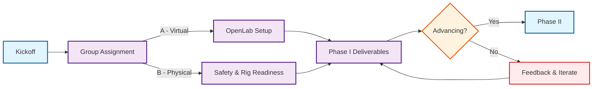

# Drillbotics® Guidelines

### Canonical competition rules and resources

[:octicons-arrow-right-24: 🚀 Start here](competition/overview.md){ .md-button .md-button--primary }
[💻 Group A (Virtual)](tracks/group-a/overview.md){ .md-button }
[🛠️ Group B (Physical)](tracks/group-b/overview.md){ .md-button }

 
??? tip "New to Drillbotics? (expand)"
    Skim the [Overview](competition/overview.md), then jump to the Quick Start below.

## At-a-glance flow

 
*[D‑WIS]: Drilling‑Well Information System
*[OpenLab]: Drilling simulation environment used in Group A

!!! info inline end "Submission window"
    See [Timeline & Milestones](competition/timeline.md) for current open/close dates.

=== "Group A (Virtual)"

_Requires: OpenLab + D‑WIS._

[:octicons-rocket-24: Overview](tracks/group-a/overview.md){ .md-button .md-button--primary }
[:octicons-gear-24: Technical specs](tracks/group-a/technical-specs.md){ .md-button }
[:octicons-checklist-24: Deliverables](tracks/group-a/deliverables.md){ .md-button }
[:octicons-trophy-24: Judging](tracks/group-a/judging.md){ .md-button }

=== "Group B (Physical)"

_Requires: Lab safety training + rig readiness._

[:octicons-rocket-24: Overview](tracks/group-b/overview.md){ .md-button .md-button--primary }
[:octicons-shield-24: Safety & risk](tracks/group-b/safety.md){ .md-button }
[:octicons-cpu-24: Hardware](tracks/group-b/hardware.md){ .md-button }
[:octicons-checklist-24: Deliverables & testing](tracks/group-b/deliverables.md){ .md-button }
[:octicons-trophy-24: Judging](tracks/group-b/judging.md){ .md-button }

## For Participants

- :material-gavel: **1) Understand the rules**  \
  Read goals, governance, scoring, and safety.  \
  [:octicons-book-24: Rules & Scoring](competition/rules-scoring.md){ .md-button }

- :material-compare: **2) Choose your track**  \
  Pick **A (Virtual)** or **B (Physical)** interfaces.  \
  [:octicons-arrow-right-24: Compare A vs B](tracks/deliverables.md){ .md-button }

- :material-calendar-check: **3) Plan deliverables & dates**  \
  Know what’s due and when.  \
  [:octicons-milestone-24: Timeline](competition/timeline.md){ .md-button }

- :material-lifebuoy: **4) Get help & resources**  \
  FAQs and original PDFs.  \
  [:octicons-question-24: FAQ](faq.md){ .md-button }

## New Team Checklist

Use this quick checklist to set up your team. See the linked pages for details.

- [ ] Confirm eligibility, advisors, and team composition — [Overview](competition/overview.md)
- [ ] Choose your track — [Group A](tracks/group-a/overview.md) or [Group B](tracks/group-b/overview.md)
- [ ] Register and note all deadlines — [Timeline](competition/timeline.md)
- [ ] Set up your repo and communication channels — [Contributor Guide](contributor-guide.md)
- [ ] Review deliverables and scoring — [Rules & Scoring](competition/rules-scoring.md)
- [ ] Prepare your environment  
      Group A: OpenLab + D‑WIS;  Group B: rig, sensors, and safety procedures — [Safety](competition/safety.md)
- [ ] Submit Phase I materials; schedule Phase II planning — Deliverables pages

## Upcoming

> High‑signal dates and checkpoints for the active year.

--8<-- "_includes/upcoming.md"

## Explore

- :material-rocket-launch: **Competition Overview**  \
  Summary of goals, eligibility, deliverables, and governance.  \
  [Read more »](competition/overview.md)

- :material-robot-outline: **Group A – Virtual**  \
  D‑WIS semantics, OpenLab, simulation interfaces, and requirements.  \
  [Start here »](tracks/group-a/overview.md)

- :material-cogs: **Group B – Physical**  \
  Mini‑rig hardware, safety, autonomy, and testing regimes.  \
  [Start here »](tracks/group-b/overview.md)

- :material-calendar-star: **Timeline & Milestones**  \
  Registration, checkpoints, final submissions, judging.  \
  [See dates »](competition/timeline.md)

- :material-help-circle: **FAQ**  \
  Common questions with canonical answers and links.  \
  [FAQ »](faq.md)

- :material-update: **What changed?**  \
  Human‑readable summaries and Git diffs per release.  \
  [Changelog »](changelog.md)

