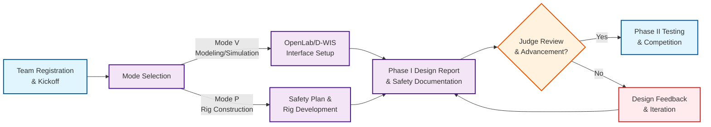

# Drillbotics® Guidelines

### Competition Rules and Resources

[:material-rocket-launch: Start here](competition/overview.md){ .md-button .md-button--primary }
[:material-laptop: Mode Virtual (V)](tracks/group-a/overview.md){ .md-button .md-button--secondary }
[:material-cog: Mode Physical (P)](tracks/group-b/overview.md){ .md-button .md-button--secondary }

 
??? tip "New to Drillbotics? (expand)"
    Skim the [Overview](competition/overview.md), then jump to the Quick Start below.

## At-a-Glance Flow

!!! info inline end "Submission window"
    See [Timeline & Milestones](competition/timeline.md) for current open/close dates.

=== "Mode Virtual (V)"

_Requires: OpenLab + D‑WIS._

[:material-rocket-launch: Overview](tracks/group-a/overview.md){ .md-button .md-button--primary }
[:material-chip: Specs](tracks/group-a/technical-specs.md){ .md-button .md-button--secondary }
[:material-clipboard-text-outline: Deliverables](tracks/group-a/deliverables.md){ .md-button }
[:material-trophy-outline: Judging](tracks/group-a/judging.md){ .md-button }

=== "Mode Physical (P)"

_Requires: Lab safety training + rig readiness._

[:material-rocket-launch: Overview](tracks/group-b/overview.md){ .md-button .md-button--primary }
[:material-shield-check: Safety & Risk](tracks/group-b/safety.md){ .md-button .md-button--secondary }
[:material-cog: Hardware](tracks/group-b/hardware.md){ .md-button }
[:material-clipboard-text-outline: Deliverables](tracks/group-b/deliverables.md){ .md-button }
[:material-trophy-outline: Judging](tracks/group-b/judging.md){ .md-button }

## For Participants

- :material-gavel: **1) Understand the rules**  
  Read goals, governance, scoring, and safety.  
  [:octicons-book-24: Rules & Scoring](competition/rules-scoring.md){ .md-button }

- :material-compare: **2) Choose your track**  
  Pick **Mode Virtual (V)** or **Mode Physical (P)** interfaces.  
  [:octicons-arrow-right-24: Compare V vs P](tracks/deliverables.md){ .md-button }

- :material-calendar-check: **3) Plan deliverables & dates**  
  Know what’s due and when.  
  [:octicons-milestone-24: Timeline](competition/timeline.md){ .md-button }

- :material-lifebuoy: **4) Get help & resources**  
  FAQs and original PDFs.  
  [:octicons-question-24: FAQ](faq.md){ .md-button }

## New Team Checklist

Use this quick checklist to set up your team. See the linked pages for details.

- [ ] Confirm eligibility, advisors, and team composition — [Overview](competition/overview.md)
- [ ] Choose your track — [Mode Virtual (V)](tracks/group-a/overview.md) or [Mode Physical (P)](tracks/group-b/overview.md)
- [ ] Register and note all deadlines — [Timeline](competition/timeline.md)
- [ ] Set up your repo and communication channels — [Contributor Guide](contributor-guide.md)
- [ ] Review deliverables and scoring — [Rules & Scoring](competition/rules-scoring.md)
- [ ] Prepare your environment  
      Mode Virtual (V): OpenLab + D‑WIS;  Mode Physical (P): rig, sensors, and safety procedures — [Safety](competition/safety.md)
- [ ] Submit Phase I materials; schedule Phase II planning — Deliverables pages

## Upcoming

> High-signal dates and checkpoints for the active year.

--8<-- "_includes/upcoming.md"

## Explore

- :material-rocket-launch: **Competition Overview**  
  Summary of goals, eligibility, deliverables, and governance.  
  [Read more »](competition/overview.md)

- :material-robot-outline: **Mode Virtual (V)**  
  D‑WIS semantics, OpenLab, simulation interfaces, and requirements.  
  [Start here »](tracks/group-a/overview.md)

- :material-cogs: **Mode Physical (P)**  
  Mini-rig hardware, safety, autonomy, and testing regimes.  
  [Start here »](tracks/group-b/overview.md)

- :material-calendar-star: **Timeline & Milestones**  
  Registration, checkpoints, final submissions, judging.  
  [See dates »](competition/timeline.md)

- :material-help-circle: **FAQ**  
  Common questions with canonical answers and links.  
  [FAQ »](faq.md)

- :material-update: **What changed?**  
  Human-readable summaries and Git diffs per release.  
  [Changelog »](changelog.md)

--8<-- "_includes/abbr.md"
